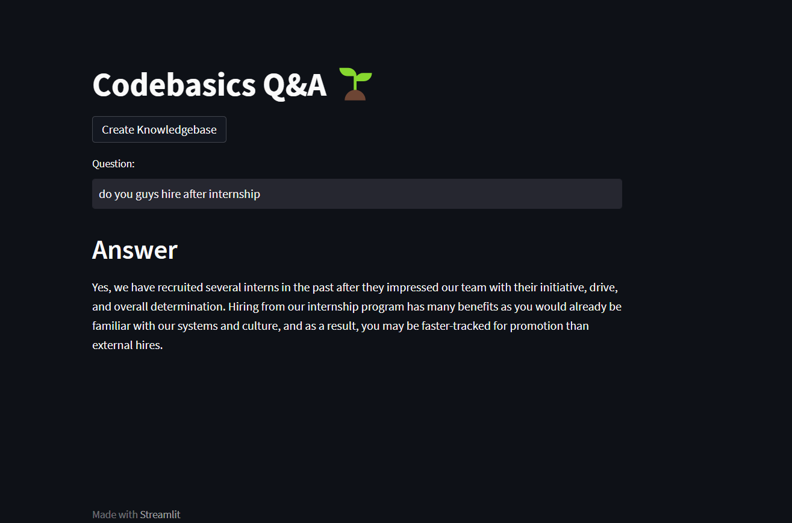

# CodeGPT Q&A Engine



## Overview
The CodeGPT Q&A Engine leverages AI to provide quick answers to frequently asked questions based on a curated knowledge base.

## Features
- AI-powered question answering
- Customizable knowledge base from CSV
- Fast and efficient retrieval of information

## Setup
1. Clone the repository:
   ```bash
   git clone https://github.com/yourusername/repo-name.git
